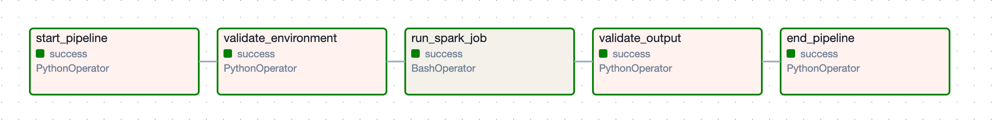

# Spark-Airflow Hello World Project

A comprehensive learning project demonstrating the integration of **Apache Spark 3.x** with **Apache Airflow 2.x** for building data pipelines. This project runs entirely on your local machine and showcases fundamental concepts of distributed data processing and workflow orchestration.

## 📋 Table of Contents

- [Overview](#overview)
- [Architecture](#architecture)
- [Technologies Used](#technologies-used)
- [Prerequisites](#prerequisites)
- [Quick Start](#quick-start)
- [Project Structure](#project-structure)
- [Detailed Setup](#detailed-setup)
- [Running the Project](#running-the-project)
- [Understanding the Code](#understanding-the-code)
- [Testing](#testing)
- [Monitoring and Debugging](#monitoring-and-debugging)
- [Troubleshooting](#troubleshooting)
- [Learning Resources](#learning-resources)
- [Contributing](#contributing)

## 🎯 Overview

This project demonstrates:

- **Spark Data Processing**: Reading CSV data, performing transformations, aggregations, and SQL queries
- **Airflow Orchestration**: Creating DAGs with task dependencies and error handling
- **Local Development**: Running both Spark and Airflow on a laptop without containers
- **Best Practices**: Comprehensive logging, error handling, configuration management, and testing

### What You'll Learn

- How to create a SparkSession and configure Spark for local execution
- Using PySpark DataFrame API and Spark SQL
- Building Airflow DAGs with multiple operators
- Managing task dependencies in Airflow
- Integrating Spark jobs into Airflow workflows
- Error handling and retry mechanisms
- Monitoring and debugging distributed applications

## 🏗️ Architecture

```
┌─────────────────────────────────────────────────────────────┐
│                     Airflow Scheduler                       │
│  (Orchestrates workflow and schedules tasks)                │
└───────────────────────┬─────────────────────────────────────┘
                        │
                        ▼
┌─────────────────────────────────────────────────────────────┐
│                    Airflow DAG                              │
│  ┌─────────┐  ┌──────────────┐  ┌──────────┐  ┌────────┐  │
│  │  Start  │─▶│   Validate   │─▶│   Spark  │─▶│ Validate│  │
│  │  Task   │  │ Environment  │  │   Job    │  │ Output │  │
│  └─────────┘  └──────────────┘  └──────────┘  └────────┘  │
└───────────────────────────────────────────────────────────┬─┘
                                                             │
                                                             ▼
┌─────────────────────────────────────────────────────────────┐
│                    Apache Spark Job                         │
│  ┌──────────┐  ┌──────────────┐  ┌────────────────────┐   │
│  │   Read   │─▶│  Transform   │─▶│    Aggregate &     │   │
│  │   CSV    │  │   & Filter   │  │    Write Output    │   │
│  └──────────┘  └──────────────┘  └────────────────────┘   │
└─────────────────────────────────────────────────────────────┘
                        │
                        ▼
            ┌───────────────────────┐
            │  data/output/         │
            │  - transformed_data   │
            │  - sales_by_category  │
            │  - avg_by_region      │
            │  - top_customers      │
            └───────────────────────┘
```

## 🛠️ Technologies Used

| Technology | Version | Purpose |
|------------|---------|---------|
| **Apache Spark** | 3.5.1 | Distributed data processing |
| **PySpark** | 3.5.1 | Python API for Spark |
| **Apache Airflow** | 2.9.3 | Workflow orchestration |
| **Python** | 3.9-3.11 | Programming language |
| **UV** | Latest | Fast Python package manager |
| **Pandas** | 2.2.2 | Data manipulation (optional) |
| **SQLite** | 3.x | Airflow metadata database |

## ✅ Prerequisites

Before you begin, ensure you have the following installed:

### Required

1. **UV Package Manager** (will install Python 3.11 automatically)
   ```bash
   curl -LsSf https://astral.sh/uv/install.sh | sh
   ```
   **Note**: You don't need Python pre-installed! UV will download Python 3.11 during setup.

2. **Java 8 or 11** (required for Spark)
   ```bash
   java -version
   ```
   
   Installation:
   - **macOS**: `brew install openjdk@11`
   - **Linux**: `sudo apt-get install openjdk-11-jdk`
   - **Windows**: Download from [Oracle](https://www.oracle.com/java/technologies/downloads/)

### Optional (for Spark installation)

4. **Apache Spark 3.5.x**
   - **macOS**: `brew install apache-spark`
   - **Linux**: Download from [Spark Downloads](https://spark.apache.org/downloads.html)
   - **Note**: PySpark includes a bundled Spark, but standalone installation recommended for full features

### System Requirements

- **RAM**: Minimum 8GB (16GB recommended)
- **Disk Space**: ~2GB for dependencies and outputs
- **OS**: macOS, Linux, or Windows (with WSL)

## 🚀 Quick Start

Get up and running in 5 minutes:

```bash
# 1. Clone the repository
git clone <your-repo-url>
cd SPARK_AIRFLOW_GENAI

# 2. Run the setup script
./scripts/setup.sh

# 3. Activate virtual environment
source .venv/bin/activate

# 4. Start Airflow
./scripts/start_airflow.sh

# 6. Access Airflow UI
# Open http://localhost:8080
# Login: admin / admin

# 7. Trigger the DAG
# Click on "hello_world_spark_airflow" DAG
# Click the "Play" button to trigger
```

## 📸 What to Expect

### Airflow UI - DAGs List
Once Airflow is running, you'll see your DAG in the UI:


### DAG Execution - Task Graph View
When you trigger the DAG, all 5 tasks will execute in sequence:



### Sample Spark Output
The Spark job processes sales data and produces aggregated results:

```
+--------------+-----------+------------+-----------+--------+----------+----------------+------+
|transaction_id|customer_id|product_name|   category|quantity|unit_price|transaction_date|region|
+--------------+-----------+------------+-----------+--------+----------+----------------+------+
|          1001|       C001|      Laptop|Electronics|       1|    1200.0|      2024-01-15| North|
|          1002|       C002|       Mouse|Electronics|       2|      25.0|      2024-01-15| South|
|          1003|       C003|  Desk Chair|  Furniture|       1|     350.0|      2024-01-16|  East|
|          1004|       C001|     Monitor|Electronics|       2|     300.0|      2024-01-16| North|
|          1005|       C004|    Keyboard|Electronics|       1|      75.0|      2024-01-17|  West|
+--------------+-----------+------------+-----------+--------+----------+----------------+------+

Sales by Category:
+-----------+-----------+-----------------+
|   category|total_sales|transaction_count|
+-----------+-----------+-----------------+
|  Furniture|     2050.0|                5|
|Electronics|     1920.0|                3|
+-----------+-----------+-----------------+

Average Transaction Value by Region:
+------+---------------------+-----------------+-----------+
|region|avg_transaction_value|transaction_count|total_sales|
+------+---------------------+-----------------+-----------+
| North|               666.67|                3|     2000.0|
|  East|                575.0|                2|     1150.0|
| South|                350.0|                2|      700.0|
|  West|                120.0|                1|      120.0|
+------+---------------------+-----------------+-----------+

Top 5 Customers:
+-----------+-----------------+-----------+
|customer_id|transaction_count|total_spent|
+-----------+-----------------+-----------+
|       C001|                2|     1800.0|
|       C006|                1|      800.0|
|       C005|                2|      700.0|
|       C003|                1|      350.0|
|       C009|                1|      200.0|
+-----------+-----------------+-----------+
```

## 📁 Project Structure

```
SPARK_AIRFLOW_GENAI/
├── README.md                  # This file
├── pyproject.toml            # Python dependencies (UV)
├── .env.example              # Environment variables template
├── .env                      # Local environment variables (not in git)
├── .gitignore               # Git ignore rules
│
├── dags/                    # Airflow DAGs directory
│   └── hello_world_dag.py   # Main DAG definition
│
├── spark_jobs/              # Spark job scripts
│   └── hello_world_spark.py # Main Spark processing job
│
├── data/                    # Data directory
│   ├── input/              # Input data files
│   │   └── sample_sales_data.csv
│   └── output/             # Spark job outputs (gitignored)
│
├── docs/                    # Documentation and assets
│   └── images/             # Screenshots and visual assets
│       ├── airflow-dags-list.png
│       └── dag-graph-view.png
│
├── config/                  # Configuration files
│   ├── airflow.cfg         # Airflow configuration
│   ├── spark.conf          # Spark configuration
│   └── log4j.properties    # Spark logging configuration
│
├── scripts/                 # Utility scripts
│   ├── setup.sh            # Complete setup script
│   ├── start_airflow.sh    # Start Airflow services
│   ├── stop_airflow.sh     # Stop Airflow services
│   └── run_spark_job.sh    # Run Spark job directly
│
├── tests/                   # Test scripts
│   └── test_spark_job.py   # Spark job tests
│
└── logs/                    # Application logs (gitignored)
    ├── airflow-standalone.log          # Combined Airflow standalone logs
    ├── scheduler.log                   # Airflow scheduler logs
    ├── webserver.log                   # Airflow webserver logs
    ├── dag_id=hello_world_spark_airflow/  # DAG task execution logs
    ├── dag_processor_manager/          # DAG file processor logs
    ├── scheduler/                      # Scheduler state and logs
    └── spark-events/                   # Spark event logs for History Server
```

## 📖 Detailed Setup

### Step 1: Initial Setup

Run the automated setup script:

```bash
./scripts/setup.sh
```

This script will:
- ✅ Check prerequisites (Python, Java, UV)
- ✅ Create Python virtual environment
- ✅ Install all dependencies
- ✅ Initialize Airflow database
- ✅ Create admin user (admin/admin)
- ✅ Set up directory structure

### Step 2: Configure Environment Variables

Edit the `.env` file created from `.env.example`:

```bash
# Open .env in your editor
nano .env  # or vim, code, etc.
```

**Important:** PySpark (installed via pip) includes all Spark binaries needed for local execution. You only need to set JAVA_HOME:

```bash
# Set your Java installation path
JAVA_HOME=/usr/local/opt/openjdk@11              # macOS
# Or: JAVA_HOME=/usr/lib/jvm/java-11-openjdk     # Linux
```

**Finding JAVA_HOME:**

```bash
# For Java (macOS)

# For Java
/usr/libexec/java_home -v 11  # macOS
# Or
which java  # Then navigate to parent directories
```

### Step 3: Verify Installation

```bash
# Activate virtual environment
source .venv/bin/activate

# Check Python packages
uv pip list | grep -E "spark|airflow"

# Check Airflow
airflow version

# Check PySpark
python3 -c "import pyspark; print(pyspark.__version__)"
```

## 🏃 Running the Project

### Option 1: Run via Airflow (Recommended)

This is the full workflow orchestration approach:

```bash
# 1. Start Airflow services
./scripts/start_airflow.sh

# 2. Access Airflow UI
# Open browser: http://localhost:8080
# Username: admin
# Password: admin

# 3. Enable and trigger the DAG
# - In the UI, find "hello_world_spark_airflow"
# - Toggle the switch to enable it
# - Click the "Play" button to trigger

# 4. Monitor execution
# - Click on the DAG name
# - View the "Graph" or "Grid" view
# - Click on individual tasks to see logs

# 5. Stop Airflow when done
./scripts/stop_airflow.sh
```

### Option 2: Run Spark Job Directly

For testing the Spark job without Airflow:

```bash
# Activate virtual environment
source .venv/bin/activate

# Run the Spark job
./scripts/run_spark_job.sh

# Or run directly with Python
python3 spark_jobs/hello_world_spark.py
```

### Viewing Results

After successful execution, check the output:

```bash
# List output files
ls -lh data/output/

# View transformed data
cat data/output/transformed_data_*/part-*.csv

# View aggregations
cat data/output/sales_by_category_*/part-*.csv
cat data/output/avg_by_region_*/part-*.csv
cat data/output/top_customers_*/part-*.csv
```

## 💡 Understanding the Code

### Spark Job (`spark_jobs/hello_world_spark.py`)

#### 1. Creating a SparkSession

```python
spark = SparkSession.builder \
    .appName("HelloWorldSparkJob") \
    .master("local[*]") \              # Use all local cores
    .config("spark.driver.memory", "2g") \
    .getOrCreate()
```

**Key Concepts:**
- `local[*]`: Run Spark locally using all available CPU cores
- `driver.memory`: Memory allocated to the driver program
- `master()`: Specifies where to run (local vs cluster)

#### 2. Reading Data

```python
df = spark.read \
    .option("header", "true") \        # First row is header
    .option("inferSchema", "true") \   # Auto-detect data types
    .csv(input_path)
```

**Key Concepts:**
- Schema inference automatically detects column types
- Options customize read behavior
- Returns a DataFrame (Spark's distributed dataset)

#### 3. DataFrame Transformations

```python
# Add calculated column
df_with_total = df.withColumn(
    "total_amount",
    col("quantity") * col("unit_price")
)

# Filter data
df_filtered = df_with_total.filter(col("total_amount") > 100)
```

**Key Concepts:**
- Transformations are lazy (not executed immediately)
- `withColumn()`: Creates or replaces a column
- `filter()`: Selects rows matching a condition

#### 4. Aggregations

```python
# Using DataFrame API
sales_by_category = df.groupBy("category") \
    .agg(
        sum("total_amount").alias("total_sales"),
        count("transaction_id").alias("transaction_count")
    )

# Using Spark SQL
df.createOrReplaceTempView("sales")
result = spark.sql("""
    SELECT category, SUM(total_amount) as total_sales
    FROM sales
    GROUP BY category
""")
```

**Key Concepts:**
- `groupBy()` + `agg()`: Group data and compute aggregates
- Spark SQL: Use familiar SQL syntax on DataFrames
- Both approaches are equally efficient

### Airflow DAG (`dags/hello_world_dag.py`)

#### 1. DAG Configuration

```python
default_args = {
    'owner': 'data-engineering-team',
    'retries': 2,                      # Retry failed tasks
    'retry_delay': timedelta(minutes=1),
    'execution_timeout': timedelta(minutes=30),
}

dag = DAG(
    'hello_world_spark_airflow',
    default_args=default_args,
    schedule_interval=None,             # Manual trigger only
    catchup=False,                      # Don't backfill
)
```

**Key Concepts:**
- `default_args`: Applied to all tasks in the DAG
- `schedule_interval`: When to run (None = manual only)
- `catchup`: Whether to run for past dates

#### 2. Task Definitions

```python
# Python task
task_validate = PythonOperator(
    task_id='validate_environment',
    python_callable=validate_environment,
    dag=dag,
)

# Bash task (runs Spark job)
task_spark = BashOperator(
    task_id='run_spark_job',
    bash_command='python3 spark_jobs/hello_world_spark.py',
    dag=dag,
)
```

**Key Concepts:**
- `PythonOperator`: Executes Python functions
- `BashOperator`: Runs shell commands
- `task_id`: Unique identifier for the task

#### 3. Task Dependencies

```python
# Linear flow
task_start >> task_validate >> task_spark >> task_end

# Alternative: Parallel tasks
task_start >> [task_a, task_b] >> task_end
```

**Key Concepts:**
- `>>`: Defines upstream → downstream relationship
- `[]`: Groups tasks (for parallel execution)
- Dependencies ensure correct execution order

## 🧪 Testing

### Running Tests

```bash
# Activate virtual environment
source .venv/bin/activate

# Run all tests
pytest tests/

# Run with coverage
pytest --cov=spark_jobs --cov=dags tests/

# Run specific test
pytest tests/test_spark_job.py::test_read_data
```

### Manual Testing

#### Test Spark Job Independently

```bash
# Run Spark job directly
./scripts/run_spark_job.sh

# Check for errors in output
echo $?  # Should return 0 for success
```

#### Test Airflow DAG

```bash
# Test DAG file for syntax errors
python3 dags/hello_world_dag.py

# Test specific task
airflow tasks test hello_world_spark_airflow start_pipeline 2024-01-01

# Test entire DAG
airflow dags test hello_world_spark_airflow 2024-01-01
```

## 📊 Monitoring and Debugging

### Airflow UI

Access at `http://localhost:8080`:

1. **DAGs View**: Overview of all DAGs
2. **Graph View**: Visual representation of tasks
3. **Task Logs**: Detailed logs for each task
4. **Gantt Chart**: Task duration and overlap

### Spark UI

While Spark job is running, access at `http://localhost:4040`:

1. **Jobs**: Overview of Spark jobs
2. **Stages**: Detailed stage information
3. **Storage**: RDD/DataFrame caching info
4. **Environment**: Spark configuration
5. **Executors**: Resource usage

### Log Files

```bash
# Airflow logs
tail -f logs/webserver.log
tail -f logs/scheduler.log

# DAG execution logs
ls logs/dag_id=hello_world_spark_airflow/

# Spark logs
# Logged to console and Airflow task logs
```

## 🔧 Troubleshooting

### Common Issues and Solutions

#### Issue 1: Java Not Found

**Error:**
```
JAVA_HOME is not set
```

**Solution:**
```bash
# Find Java installation
/usr/libexec/java_home -v 11  # macOS
# or
which java

# Set in .env
export JAVA_HOME=/path/to/java
```

#### Issue 2: Airflow Database Not Initialized

**Error:**
```
airflow.exceptions.AirflowException: Can't locate DAGs
```

**Solution:**
```bash
# Re-initialize database
export AIRFLOW_HOME=$(pwd)
airflow db reset  # Warning: Deletes all data
airflow db init
```

#### Issue 3: Port Already in Use

**Error:**
```
Address already in use: 8080
```

**Solution:**
```bash
# Find process using port
lsof -i :8080

# Kill the process
kill -9 <PID>

# Or use different port
airflow webserver --port 8081
```

#### Issue 4: Spark Job Fails with Memory Error

**Error:**
```
Java heap space OutOfMemoryError
```

**Solution:**
```python
# In spark job, increase driver memory
spark = SparkSession.builder \
    .config("spark.driver.memory", "4g") \  # Increase from 2g
    .getOrCreate()
```

#### Issue 5: Module Not Found

**Error:**
```
ModuleNotFoundError: No module named 'pyspark'
```

**Solution:**
```bash
# Ensure virtual environment is activated
source .venv/bin/activate

# Reinstall dependencies
uv pip install -e .
```

#### Issue 6: Permission Denied on Scripts

**Error:**
```
Permission denied: ./scripts/setup.sh
```

**Solution:**
```bash
# Make scripts executable
chmod +x scripts/*.sh
```

### Debug Mode

#### Enable Airflow Debug Logging

Edit `.env`:
```bash
AIRFLOW__LOGGING__LOGGING_LEVEL=DEBUG
```

#### Enable Spark Debug Logging

Edit `config/log4j.properties`:
```properties
log4j.rootCategory=DEBUG, console
log4j.logger.org.apache.spark=DEBUG
```

## 📚 Learning Resources

### Official Documentation

- [Apache Spark Documentation](https://spark.apache.org/docs/latest/)
- [PySpark API Reference](https://spark.apache.org/docs/latest/api/python/)
- [Apache Airflow Documentation](https://airflow.apache.org/docs/)
- [UV Documentation](https://github.com/astral-sh/uv)

### Next Steps

After mastering this project, explore:

1. **Advanced Spark:**
   - Structured Streaming
   - Machine Learning with MLlib
   - GraphX for graph processing
   - Performance tuning

2. **Advanced Airflow:**
   - Custom operators
   - Dynamic DAG generation
   - External task sensors
   - Production deployment

3. **Data Engineering:**
   - Delta Lake / Apache Iceberg
   - Data quality testing (Great Expectations)
   - CI/CD for data pipelines
   - Cloud deployment (AWS EMR, Databricks)

## 🤝 Contributing

Contributions are welcome! Please follow these guidelines:

1. Fork the repository
2. Create a feature branch (`git checkout -b feature/amazing-feature`)
3. Make your changes
4. Add tests for new functionality
5. Ensure all tests pass (`pytest tests/`)
6. Commit your changes (`git commit -m 'Add amazing feature'`)
7. Push to the branch (`git push origin feature/amazing-feature`)
8. Open a Pull Request

## 📄 License

This project is licensed under the MIT License - see the LICENSE file for details.

## 🙏 Acknowledgments

- Apache Spark and Airflow communities
- Contributors and learners who provide feedback
- Educational resources that inspired this project

## 📧 Contact

For questions or feedback:
- Open an issue on GitHub
- Email: []

---

**Happy Learning! 🚀**

Remember: The best way to learn is by doing. Experiment with the code, break things, fix them, and understand why they work. Good luck on your data engineering journey!
